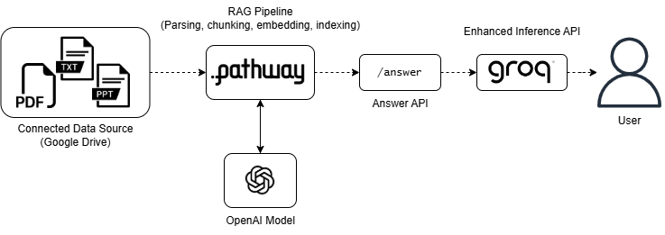

# Caduceus 🩺

[](https://opensource.org/licenses/MIT)
[](https://www.python.org/downloads/)

**Clinical Augmentation & Diagnostic Understanding Expert System**

Caduceus is an AI-powered clinical support system designed to enhance medical decision-making through secure integration with patient data sources and evidence-based clinical reasoning.

## Features ✨

- **Multi-Source Data Integration**
  - Direct Google Drive connectivity for medical documents (PDF/PPTX)
  - Automated document parsing and metadata extraction
  - Real-time data synchronization (30s refresh interval)

- **Clinical Intelligence Engine**
  - Context-aware RAG pipeline with GPT-4o-mini
  - Adaptive medical Q&A with iterative refinement
  - Clinical safety protocols and conflict detection

- **Secure Workflow Integration**
  - HIPAA-compliant data handling
  - EMR-ready output formatting
  - Medication safety checks & allergy alerts

- **Medical-Grade Analysis**
  - Differential diagnosis matrix
  - Evidence grading (CLASS I-III)
  - Clinical timeline reconstruction

## Workflow Overview 🔄


## Installation 💻

1. Clone repository:
```bash
git clone https://github.com/yourorg/caduceus.git
cd caduceus
```

2. Install dependencies:
```bash
pip install -r requirements.txt
pip install google-api-python-client oauth2client
```

3. Set up credentials:
- Create Google Service Account credentials (`credentials.json`)
- Obtain API keys:
  - [Groq Cloud](https://console.groq.com/)
  - [OpenAI](https://platform.openai.com/)

## Configuration ⚙️

1. Create `.env` file:
```env
PARENT_FOLDER_ID=your_google_drive_folder_id
GROQ_API_KEY=your_groq_key
OPENAI_API_KEY=your_openai_key
```

2. Google Drive setup:
- Share target folder with service account email
- Enable Google Drive API in your project

## Usage 🚀

1. Launch patient selector:
```bash
streamlit run main.py
```

2. In the UI:
- Select patient folder from dropdown
- Click "Load Data" to initialize RAG pipeline
- Access chat interface for clinical queries

3. Document management:
- Upload new medical files via sidebar
- Automatic index refresh every 30 seconds

## API Integration 🌐

Caduceus exposes a REST API endpoint for programmatic access:

**Endpoint**: `POST http://localhost:8000/v1/ask`

**Sample Request**:
```json
{
  "query": "What is the latest HbA1c value for patient X?",
  "context": {
    "mrn": "123456",
    "max_results": 3
  }
}
```

## Contributing 🤝

We welcome medical professionals and developers to contribute:
1. Fork the repository
2. Create feature branch (`git checkout -b feature/improvement`)
3. Commit changes following [Conventional Commits](https://www.conventionalcommits.org/)
4. Push to branch and open a PR

## License 📄

This project is licensed under the MIT License - see the [LICENSE](LICENSE) file for details.

## Acknowledgments 🏥

- Pathway framework for real-time data processing
- GroqCloud for low-latency inference
- OpenAI medical embedding capabilities
- Google Healthcare API standards

---

**Important**: This system is intended for clinical support only and should not replace professional medical judgment. Always verify AI-generated recommendations against primary sources.